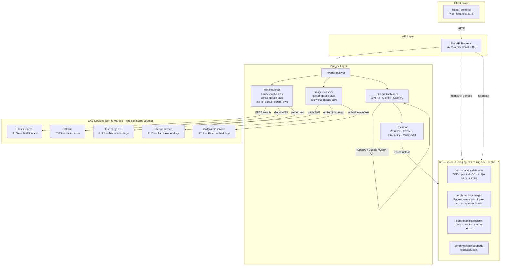
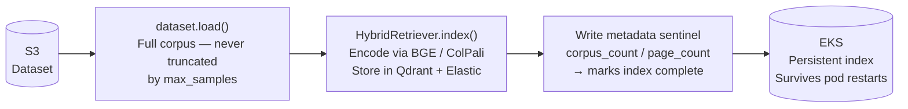
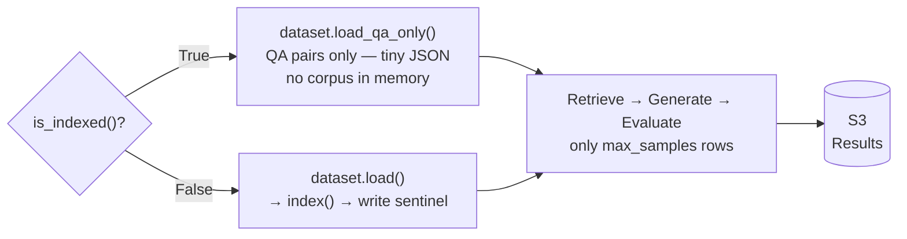
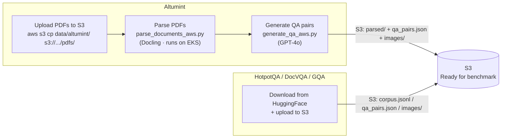
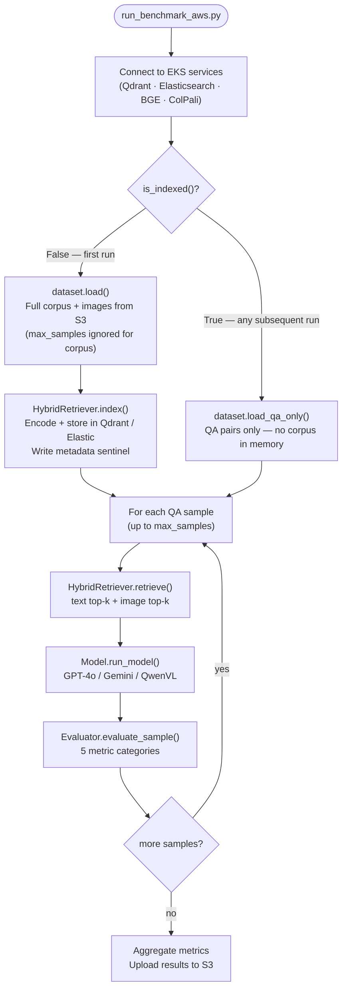
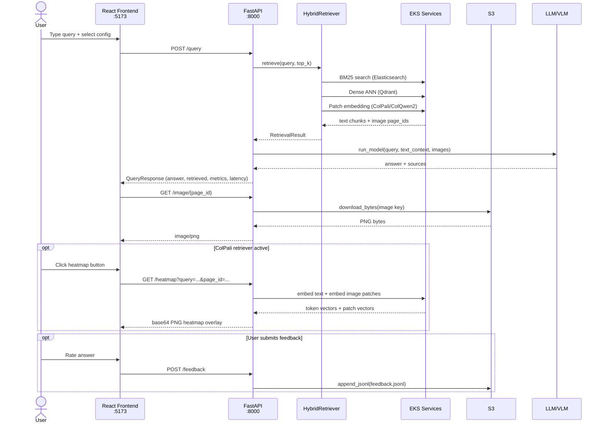
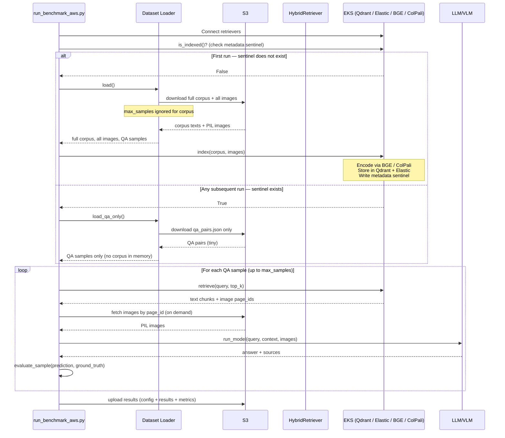
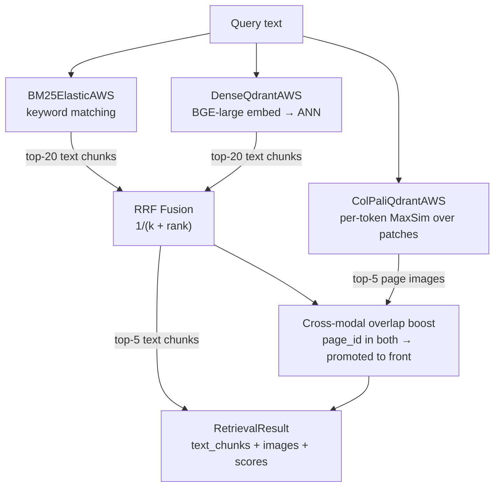
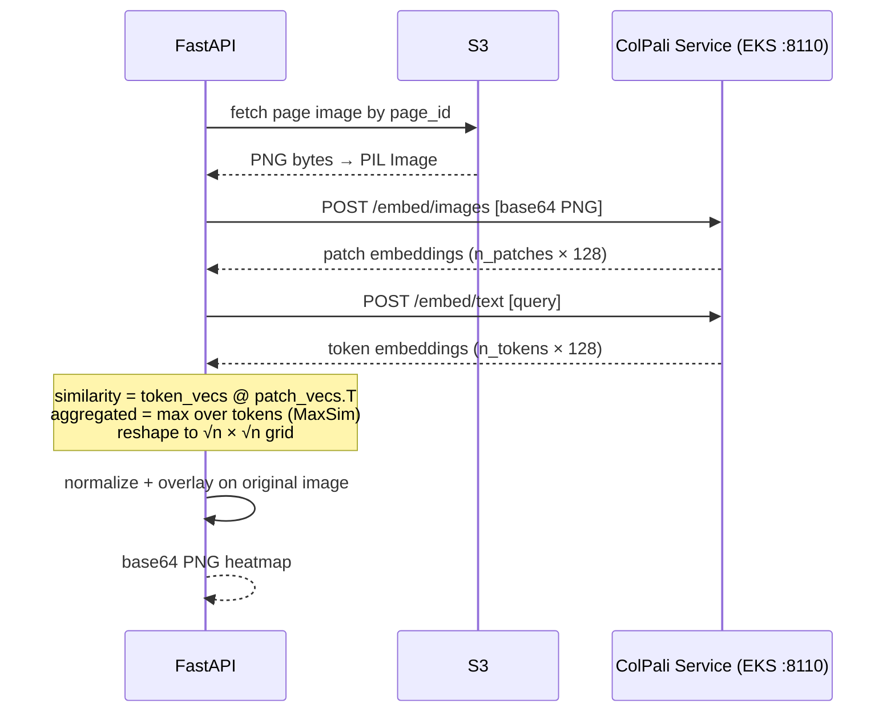
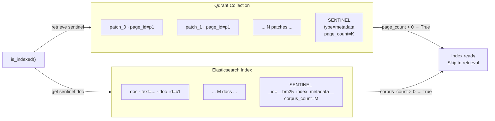

# Multimodal RAG Benchmark

A benchmarking pipeline for evaluating multimodal Retrieval-Augmented Generation (RAG) systems that combine text and image retrieval with LLM/VLM generation. Runs entirely on AWS — all data lives in S3, all ML inference services run on EKS.

The pipeline is split into two completely separate phases:

- **Phase 1 — Offline Indexing (once per dataset):** Parse documents, encode corpus, store in Qdrant/Elasticsearch. Done once. Survives pod restarts, port-forward drops, and node replacements because Qdrant and ES are backed by persistent EBS volumes on EKS.
- **Phase 2 — Benchmark Loop (every run):** Load QA pairs, retrieve from existing index, generate answers, evaluate, upload results to S3. Fast and repeatable — only `max_samples` rows are processed each run.

---

## Table of Contents

- [Architecture Overview](#architecture-overview)
- [Two-Phase Design](#two-phase-design)
- [EKS Services](#eks-services)
- [S3 Layout](#s3-layout)
- [Setup](#setup)
- [Data Pipeline](#data-pipeline)
- [Running the Benchmark](#running-the-benchmark)
- [UI Server](#ui-server)
- [Flow Diagrams](#flow-diagrams)
- [Configuration](#configuration)
- [Evaluation Metrics](#evaluation-metrics)
- [Adding New Components](#adding-new-components)

---

## Architecture Overview



---

## Two-Phase Design

### Phase 1 — Offline Indexing (run once per dataset)



Key properties:
- `max_samples` **never affects** what gets indexed — always the full corpus
- A metadata sentinel is written only after the full corpus is successfully indexed
- `is_indexed()` checks `sentinel exists AND count > 0` — partial indexes (killed mid-run) are detected and re-indexed cleanly
- docvqa/gqa build the full image corpus from all QA pairs before applying `max_samples` to eval samples

### Phase 2 — Benchmark Loop (every run)



From the second run onwards, for any `max_samples` value:
- Index is reused as-is (persistent EBS)
- Only QA pairs are loaded into memory
- Retrieval hits the existing Qdrant/ES collections directly
- Results are uploaded to S3 per run

This means you can freely change `max_samples`, the model, or the evaluation config and re-run in seconds without ever paying the indexing cost again.

---

## EKS Services

| Service | Port | Purpose | Model |
|---|---|---|---|
| Elasticsearch | `9200` | BM25 full-text index | — |
| Qdrant | `6333` | Vector ANN store (text + image) | — |
| BGE-large TEI | `8112` | Text embeddings for dense retrieval | `BAAI/bge-large-en-v1.5` (1024-dim) |
| ColPali | `8110` | Patch-level image embeddings | `vidore/colpali-v1.3` (128-dim) |
| ColQwen2 | `8111` | Patch-level image embeddings | `vidore/colqwen2-v1.0` (128-dim) |

All services are backed by persistent EBS volumes — data survives pod restarts. Access via `kubectl port-forward` to localhost:

```bash
bash scripts/port-forward-benchmarking.sh
```

---

## S3 Layout

```
spatial-ai-staging-processing-632872792182/
└── benchmarking/
    ├── datasets/
    │   └── {dataset}/
    │       ├── pdfs/           ← raw PDFs (upload source for parse_documents_aws.py)
    │       ├── parsed/         ← per-page JSONs (text + table + figure metadata)
    │       ├── corpus.jsonl    ← deduplicated text passages (hotpotqa only)
    │       └── qa_pairs.json   ← question/answer pairs
    ├── images/
    │   └── {dataset}/
    │       └── figures/        ← page screenshots (*_page.png) + figure crops
    ├── results/
    │   └── {run_name}/
    │       ├── config.json
    │       ├── results.json
    │       └── metrics.json
    └── feedback/
        └── feedback.jsonl
```

---

## Setup

### 1. Install dependencies

```bash
uv sync
```

### 2. Configure API keys

```bash
# .env
OPENAI_API_KEY=sk-...
GOOGLE_API_KEY=...                      # Gemini via Google AI Studio
GOOGLE_APPLICATION_CREDENTIALS=...     # Gemini via Vertex AI
QWEN_VL_API_KEY=...                    # Self-hosted Qwen endpoint
```

### 3. Port-forward EKS services

```bash
bash scripts/port-forward-benchmarking.sh
```

---

## Data Pipeline

Run once per dataset to populate S3. After this the benchmark runner never needs local data.



### Altumint (proprietary PDFs)

```bash
# 1. Upload PDFs to S3
aws s3 cp data/altumint/ s3://spatial-ai-staging-processing-632872792182/benchmarking/datasets/altumint/pdfs/ \
  --recursive --include "*.pdf"

# 2. Parse (Docling) — outputs per-page JSONs + images to S3
uv run python scripts/parse_documents_aws.py --dataset altumint --config configs/aws.yaml

# 3. Generate QA pairs — outputs qa_pairs.json to S3
uv run python scripts/generate_qa_aws.py --dataset altumint --config configs/aws.yaml
```

### HotpotQA / DocVQA / GQA (public datasets)

```bash
uv run python -m scripts.upload_hotpotqa_to_s3 --config configs/aws.yaml
uv run python -m scripts.upload_docvqa_to_s3   --config configs/aws.yaml
uv run python -m scripts.upload_gqa_to_s3      --config configs/aws.yaml
```

---

## Running the Benchmark



```bash
RAG_CONFIG=configs/aws.yaml uv run python -m pipeline.runners.run_benchmark_aws --config configs/aws.yaml
```

**First run** — builds index from full corpus (slow, encoding all pages/chunks). Subsequent runs reuse the same index.

**Subsequent runs** — `is_indexed()` finds the metadata sentinel → skips corpus load and encoding entirely → straight to retrieval and evaluation. Fast regardless of `max_samples`.

**Changing `max_samples`** — never triggers re-indexing. The index is always the full corpus; `max_samples` only controls how many QA pairs are evaluated each run.

---

## UI Server



```bash
# Terminal 1 — FastAPI backend
RAG_CONFIG=configs/aws.yaml uvicorn pipeline.api.main:app --reload --port 8000

# Terminal 2 — React frontend
cd frontend && npm run dev
```

Open `http://localhost:5173`

### API Endpoints

| Method | Path | Description |
|---|---|---|
| `GET` | `/health` | Pipeline status and active component names |
| `GET` | `/config/options` | Available datasets, retrievers, models |
| `POST` | `/query` | Run full RAG pipeline for one query |
| `GET` | `/image/{page_id}` | Fetch page screenshot from S3 |
| `GET` | `/heatmap` | ColPali similarity heatmap (PNG base64) |
| `POST` | `/upload-query-image` | Upload visual query image → S3 key |
| `POST` | `/feedback` | Append feedback record to S3 JSONL |
| `GET` | `/storage` | Qdrant collection stats |

---

## Flow Diagrams

### Offline Indexing vs Benchmark Loop



### Hybrid Retrieval — RRF Fusion



### ColPali Heatmap Generation



### Sentinel-Based Index State Detection



---

## Configuration

All pipeline behavior is controlled by `configs/aws.yaml`.

```yaml
dataset:
  name: "altumint_aws"          # altumint_aws | hotpotqa_aws | docvqa_aws | gqa_aws
  s3_prefix: "altumint"         # S3 key prefix (matches parse/generate scripts)
  max_samples: null             # null = evaluate full QA set
                                # integer = evaluate N QA pairs (index always full corpus)

retrieval:
  text:
    method: "hybrid_elastic_qdrant_aws"   # bm25_elastic_aws | dense_qdrant_aws | hybrid_elastic_qdrant_aws
    top_k: 5
  image:
    method: "colpali_qdrant_aws"          # colpali_qdrant_aws | colqwen2_qdrant_aws
    top_k: 5

model:
  name: "gemini_vertex"         # gpt | gemini | gemini_vertex | qwen_vl_aws

evaluation:
  backend: "production"         # custom (fast, no deps) | production (ranx + HF evaluate + RAGAS)
```

**`max_samples` semantics:** controls how many QA pairs are evaluated per run. The corpus indexed is always 100% of the dataset — changing `max_samples` never triggers re-indexing.

---

## Evaluation Metrics

| Category | Metrics |
|---|---|
| **Retrieval** | Recall@k, MRR, nDCG |
| **Answer** | Exact Match, F1, ANLS |
| **Grounding** | Faithfulness (RAGAS LLM-as-judge), Attribution Accuracy |
| **Multimodal** | VQA Accuracy (standard VQA protocol), Cross-modal Consistency |

Two backends selectable via `evaluation.backend`:
- `custom` — fast numpy/regex implementations, no API calls, good for iteration
- `production` — ranx (IR metrics) + HuggingFace evaluate (EM/F1) + RAGAS (faithfulness)

---

## Adding New Components

All components use a **registry/factory pattern** — add a subclass, register it, done.

### New Dataset

```python
from pipeline.datasets.base import BaseDataset, register_dataset

@register_dataset("my_dataset_aws")
class MyDatasetAWS(BaseDataset):
    def load(self) -> None:
        # Load full corpus (ALL items — never truncate by max_samples here)
        # Apply max_samples only to self.samples for evaluation
        ...
    def load_qa_only(self) -> None:
        # Load only QA pairs JSON — no corpus, no images in memory
        ...
    def get_corpus(self): ...
    def get_images(self): ...
```

Import in `pipeline/datasets/__init__.py`. Add to `_AVAILABLE_DATASETS` in `pipeline_service.py`.

### New Retriever

```python
from pipeline.retrieval.base import BaseRetriever, register_retriever

@register_retriever("my_retriever_aws")
class MyRetrieverAWS(BaseRetriever):
    _METADATA_ID = ...  # unique sentinel ID

    def is_indexed(self) -> bool:
        # Check sentinel exists AND count > 0
        # Do NOT load corpus to check this
        ...
    def index(self, corpus, corpus_ids):
        # Encode and store full corpus
        # Write sentinel ONLY after successful completion
        ...
    def retrieve(self, query, top_k, query_image):
        # Exclude sentinel from results (must_not type=metadata)
        ...
    def storage_info(self): ...
```

Import in `pipeline/retrieval/__init__.py`. Add to `_AVAILABLE_TEXT_METHODS` or `_AVAILABLE_IMAGE_METHODS` in `pipeline_service.py`.

### New Model

```python
from pipeline.models.base import BaseModel, register_model

@register_model("my_model_aws")
class MyModelAWS(BaseModel):
    def run_model(self, question, text_context, image_context, ...) -> ModelResult: ...
```

Import in `pipeline/models/__init__.py`. Add to `_AVAILABLE_MODELS` in `pipeline_service.py`.
